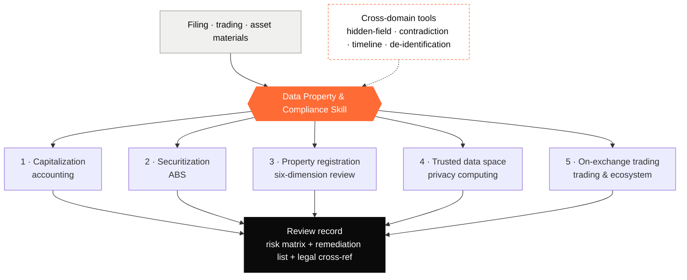

# Data Property and Compliance Skill
### Data-Element Lifecycle Compliance-Review Framework

🌐 [中文](./README.md) · **English**

> ℹ️ This version contains only ① publicly verifiable sources and ② the author's original methodology — no substance from any confidential internal material — and has passed two rounds of adversarial compliance audit (0 blockers).

> A systematic self-check / training framework covering the **full data-element lifecycle**: from accounting capitalization to securitization, from data-property registration to trusted circulation, from exchange trading to ecosystem partnerships.
> Shipped as an AI-agent **Skill** ([`SKILL.md`](./SKILL.md)); also usable as a manual review checklist.

> ⚠️ The framework body (`SKILL.md`) is written in Chinese (PRC data law). This English README is a guide to its scope and use.

## Table of Contents

- [Disclaimer](#disclaimer-read-first)
- [Scope (five domains)](#scope-five-domains)
- [Architecture](#architecture)
- [How to use](#how-to-use)
- [About this open-source version](#about-this-open-source-version)
- [Accuracy & maintenance](#accuracy--maintenance)
- [License](#license)
- [Contributing](#contributing)

---

## Disclaimer (read first)

- This framework is **for study and practitioner reference only. It is NOT legal advice and does NOT constitute the practice of law.**
- Laws, regulations, rules, national standards and exchange trading rules in this field change quickly; **article numbers and details herein may already be outdated**. Always rely on the **current, in-force text**, and consult a qualified professional or the competent authority for specific matters.
- All judgments, risk levels and remediation-cost figures are **generic estimates / methodology**, not directed at any specific party; real decisions require case-by-case analysis and formal compliance / legal review.
- The author and contributors accept **no liability** for any consequences of using this framework.

---

## Scope (five domains)

| Domain | Contents |
|---|---|
| 1 · Data-asset capitalization | Accounting treatment, cost accounting, initial/subsequent measurement, impairment, valuation methods |
| 2 · Data-asset securitization (ABS) | SPV, asset pool, credit enhancement, cash flow, valuation difficulties |
| 3 · Data-property registration (core) | Six-dimension review, contradiction detection, article-level legal cross-reference |
| 4 · Trusted data space | Privacy computing, blockchain attestation, access control, "available-but-invisible" data |
| 5 · On-exchange trading | Trading modes & states, service flow, registration materials, ecosystem partners (always per each exchange's published rules) |

Plus **cross-domain review tools**: PDF hidden-field discovery, cross-table contradiction detection, timeline audit, SaaS-role analysis, MLPS (等保) vs CCRC/ISO distinction, de-identification vs anonymization distinction.

---

## Architecture

> Full English framework: [SKILL.en.md](./SKILL.en.md).

---

## How to use

**As an AI Skill (recommended)**
Drop [`SKILL.md`](./SKILL.md) into a Skills-capable agent environment (e.g. the skills directory of Claude Code / Codex). It triggers on data-element compliance questions and guides output along the structure: six-dimension review + legal cross-reference + contradiction detection + risk matrix + remediation checklist.

**As a manual checklist**
Walk the `- [ ]` checklist items in `SKILL.md` against the filing / trading materials, focusing on: source consistency, truthful personal-information declaration, rights-allocation consistency, and security capability.

---

## About this open-source version

This repo's content is of two kinds only — ① **publicly verifiable sources** (published laws, administrative regulations, departmental rules, national standards, national-level plans/measures, and exchanges' **officially published** trading rules / national model contracts), and ② the **author's original methodology** (review dimensions, contradiction detection, timeline audit, risk matrix, etc.).

To make it safe to publish, the following were done:
- ✂️ **No internal-material substance**: does not copy or paraphrase any article numbers, criteria or lists that exist only in non-public internal material; any "judgment/limit" that cannot point to a public source was rewritten as analysis based on public law, or annotated "per the locally published rules in force."
- 🕵️ **De-cased**: removed real applicants, contract numbers, data-product identifiers; all examples are **redacted / illustrative**.
- ⚖️ **Citation review**: corrected article numbers (e.g. surveying qualification = Surveying & Mapping Law Art. 27; no-qualification penalty = Art. 55); volatile numbers annotated "per current text."
- 🌐 **De-localized**: exchange trading and ecosystem-partner specifics changed to the neutral "per each exchange's published rules."

> ✅ This version passed two rounds of adversarial compliance audit (0 blocker / 0 high), with no residual named parties, case-identifiable information, or non-public internal wording.

---

## Accuracy & maintenance

- Citations / rules marked ⚠️ in `SKILL.md` **especially need checking against the current text**.
- PRs welcome to update outdated rules, add regional variations, or fix article numbers. In the PR, state the **regulation name, version and effective date** plus a source link.
- The last-revised date is in the version line at the top of `SKILL.md`.

---

## License

[CC BY 4.0](./LICENSE) (Attribution 4.0 International). Free to share and adapt, including commercially, **with attribution**.

Suggested attribution:
> "Data Property and Compliance Skill — 数据要素全生命周期合规审查框架" by Cong Yu, licensed under CC BY 4.0. Source: https://github.com/Yco-0314/data-property-and-compliance-skill

> Note: if you later add **scripts** (PDF extraction / OCR / validation), license the **code** under MIT/Apache-2.0 (`tools/`) while keeping the content under CC BY 4.0.

---

## Contributing

Issues / PRs welcome:
- Regulation updates and article-number fixes (with sources)
- New review tools / checklist items
- Regional variations and cross-border scenarios

See [`CONTRIBUTING.md`](./CONTRIBUTING.md). Submitting a PR is deemed acceptance of licensing your contribution under this repo's licenses.
