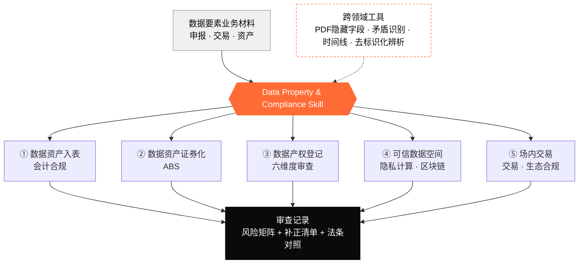

# Data Property and Compliance Skill
### 数据要素全生命周期合规审查框架

🌐 **中文** · [English](./README.en.md)

> ℹ️ 本版本为**净室重写版**：内容仅含 ①可公开核验来源 ②作者原创方法论，已剥离任何非公开内部资料的实质内容，并经两轮对抗式合规审计（0 blocker）。

> 一套覆盖**数据要素全生命周期**的系统化合规自查 / 培训框架：从会计入表到金融证券化，从数据产权登记到可信流通，从场内交易到生态合作。
> 以 AI Agent **Skill** 形式提供（[`SKILL.md`](./SKILL.md)），也可直接当作人工审查 checklist 使用。

## 目录

- [免责声明](#免责声明请先阅读)
- [覆盖范围（五大领域）](#覆盖范围五大领域)
- [架构](#架构)
- [怎么用](#怎么用)
- [关于本开源版本](#关于本开源版本透明说明)
- [准确性与维护](#准确性与维护)
- [许可证](#许可证)
- [贡献](#贡献)

---

## 免责声明（请先阅读）

- 本框架**仅供学习与实务参考，不构成法律意见，也不构成执业法律服务**。
- 数据要素相关**法律、法规、规章、国家标准与交易规则更新很快**，文中条文编号、制度细则**可能已经变更**。**使用前请以现行有效文本为准**，并就具体事项咨询有资质的专业人士或主管部门。
- 框架中的判断、风险等级、整改成本均为**通用估算与方法论**，不针对任何具体主体；真实决策需结合个案与正式合规 / 法律审查。
- 作者与贡献者对因使用本框架产生的任何后果**不承担责任**。

---

## 覆盖范围（五大领域）

| 领域 | 内容 |
|---|---|
| 一 · 数据资产入表 | 会计处理、成本核算、初始/后续计量、减值、估值方法 |
| 二 · 数据资产证券化（ABS） | SPV、资产池、信用增级、现金流、估值难点 |
| 三 · 数据产权登记（核心） | 六维度审查、矛盾识别、法律法规条文级对照 |
| 四 · 可信数据空间 | 隐私计算、区块链存证、访问控制、"数据可用不可见" |
| 五 · 场内交易 | 交易模式与状态、服务流程、登记材料、生态合作（均以各交易所公开规则为准） |

外加**跨领域通用审查工具**：PDF 隐藏字段发现、表格间矛盾识别、时间线审计、SaaS 角色辨析、等保 vs CCRC/ISO 辨析、去标识化 vs 匿名化辨析。

---

## 架构

> 英文版框架说明见 [SKILL.en.md](./SKILL.en.md)。

---

## 怎么用

**作为 AI Skill（推荐）**
把 [`SKILL.md`](./SKILL.md) 放进支持 Skills 的 Agent 环境（如 Claude Code / Codex 的 skills 目录），在审查数据要素合规问题时自动触发。它会引导按"六维度 + 法规对照 + 矛盾识别 + 风险矩阵 + 补正清单"的结构产出审查记录。

**作为人工 checklist**
直接按 `SKILL.md` 中的检查项（`- [ ]`）逐项核对申报 / 交易材料，重点关注：来源口径是否自洽、个人信息是否如实申报、权益配置是否一致、安全能力是否到位。

---

## 关于本开源版本（透明说明）

本仓库为**净室重写版**：内容只有两类——①**可公开核验的来源**（已公布的法律、行政法规、规章、国家标准、国家级规划/办法，及交易所**官网公开发布**的交易规则、国家数据局示范文本），②**作者原创的通用方法论**（审查维度、矛盾识别、时间线审计、风险矩阵等）。

为可安全公开，已做：
- ✂️ **不含内部资料实质**：不复制、不转述任何只存在于非公开内部资料中的具体条号、判定口径或清单；凡无法指向公开来源的"判定/限制"，一律改为依据公开法律自行分析，或注明"以各地正式公布的规则为准"。
- 🕵️ **去案例化**：删除真实申请人、合同编号、数据产品等可识别信息，示例均为**脱敏 / 示意**。
- ⚖️ **法条校订**：修正条号（如测绘资质管理为《测绘法》第二十七条；未取得资质处罚为第五十五条），易变条号统一加注"以现行有效文本为准"。
- 🌐 **去地域绑定**：场内交易、生态合作伙伴等改为"以各交易所公开规则为准"的中性表述。

> ✅ 本版本已经过两轮对抗式合规审计（0 blocker / 0 high），无具名主体、案例可识别信息或非公开内部口径的实质残留。

---

## 准确性与维护

- 文中标注 ⚠️ 的条号 / 规则**尤其需要核对现行文本**。
- 欢迎提交 PR 修订过期法规、补充地区差异、纠正条号。请在 PR 中注明**法规名称、版本与生效日期**及出处链接。
- 最后校订日期见 `SKILL.md` 顶部版本行。

---

## 许可证

[CC BY 4.0](./LICENSE)（署名 4.0 国际）。可自由分享、改编，包括商用，**须署名**。

建议署名：
> "数据要素全生命周期合规审查框架" by `Cong Yu`，licensed under CC BY 4.0。Source: https://github.com/Yco-0314/data-property-and-compliance-skill 。

> 注：如果你后续加入了**自动化脚本**（如 PDF 提取 / OCR / 校验工具），建议对**代码部分单独采用 MIT/Apache-2.0**，内容部分保留 CC BY 4.0，并在 README 中分别注明。

---

## 贡献

欢迎 Issue / PR：
- 法规更新与条号纠错（附出处）
- 新增审查工具 / checklist 项
- 地区差异与跨境场景补充

提交即视为同意以本仓库许可证授权你的贡献。
